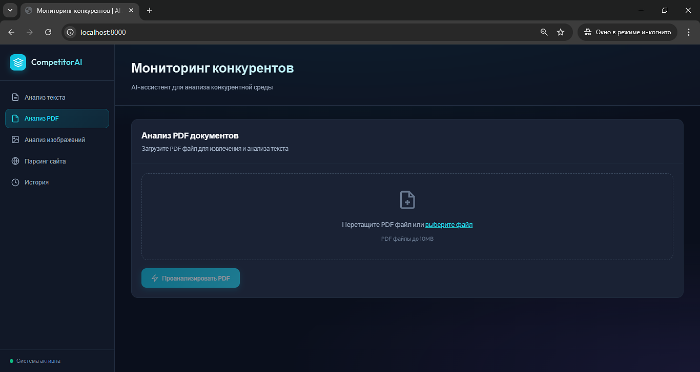
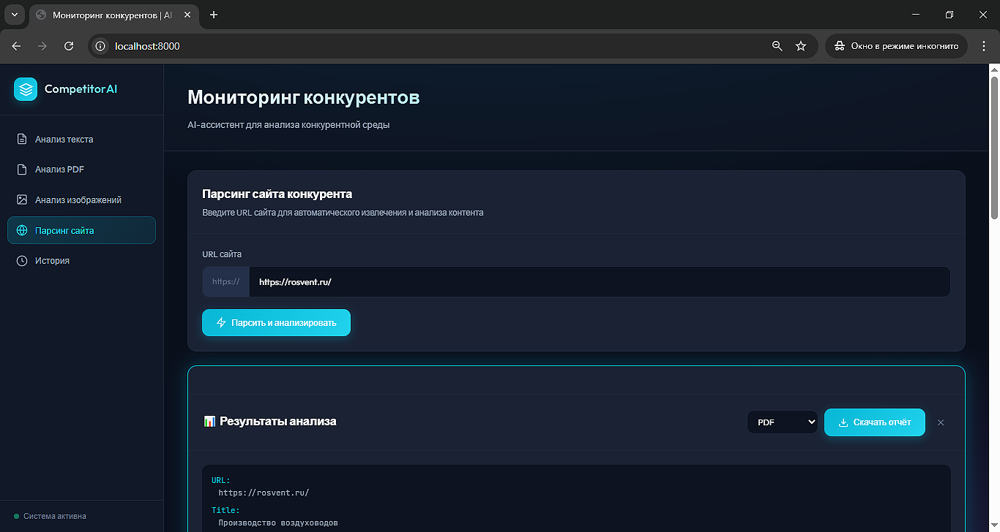
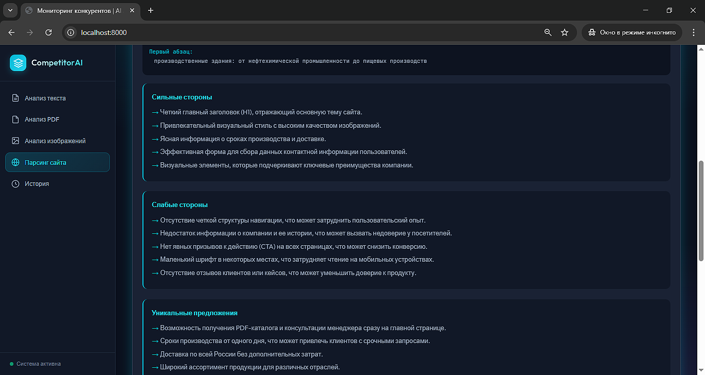
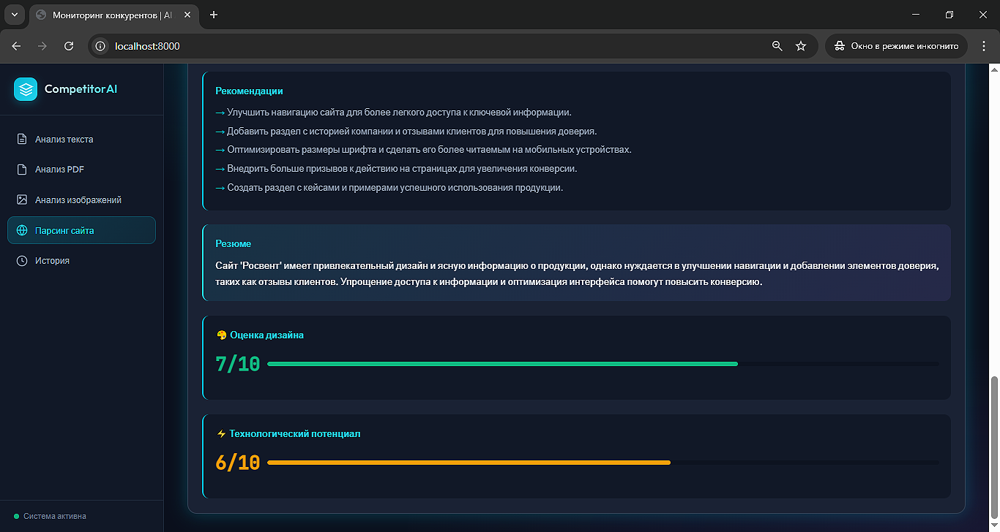

<div align="center">

# 🔍 CompetitorAI - Мониторинг конкурентов


**MVP приложение для анализа конкурентной среды с поддержкой мультимодальности (текст, изображения, PDF)**

</div>

---

## 📋 Описание

CompetitorAI — это приложение для анализа конкурентов с помощью AI и получения структурированной аналитики. Доступны web и desktop версии.

**Возможности:**
- **📝 Анализ текста** — сильные/слабые стороны, УТП, рекомендации
- **🖼️ Анализ изображений** — оценка визуального стиля (0-10)
- **📄 Анализ PDF** — извлечение и анализ документов
- **🌐 Парсинг сайтов** — Selenium + BeautifulSoup
- **📊 Генерация отчётов** — HTML, Markdown, PDF
- **📋 История** — сохранение последних запросов

---

## 🚀 Быстрый старт

### Backend (FastAPI)

```bash
# Клонирование
cd ai-web-parser-analyst

# Создание venv
python -m venv venv
.\venv\Scripts\activate

# Установка зависимостей
pip install -r requirements.txt

# Настройка .env
cp env.example.txt .env
# PROXY_API_KEY=your_proxy_api_key_here

# Запуск
python run.py
```

**Доступ:**
- Web-интерфейс: http://localhost:8000
- API Docs: http://localhost:8000/docs

---

### Desktop приложение (PyQt6)

```bash
cd desktop

# Отдельный venv
python -m venv venv
.\venv\Scripts\activate

# Установка зависимостей
pip install -r requirements.txt

# Запуск
python main.py

# Сборка в .exe
pip install pyinstaller
pyinstaller --onefile --windowed --name CompetitorMonitor main.py
```

---

## 📁 Структура проекта

```
ai-web-parser-analyst/
├── backend/                  # FastAPI сервер
│   ├── main.py               # Главный файл приложения
│   ├── config.py             # Конфигурация (Pydantic Settings)
│   ├── models/
│   │   └── schemas.py        # Pydantic схемы
│   └── services/
│       ├── openai_service.py      # GPT-4 анализ (текст + Vision)
│       ├── parser_service.py      # Selenium парсинг
│       ├── http_parser_service.py # HTTP парсинг (быстрый)
│       ├── pdf_service.py         # PDF анализ
│       ├── report_service.py      # Генерация отчётов
│       └── history_service.py     # История запросов
├── frontend/                 # Web-интерфейс
│   ├── index.html            # HTML
│   ├── styles.css            # Стили (Dark theme)
│   └── app.js                # JavaScript логика
├── desktop/                  # Desktop приложение (PyQt6)
│   ├── main.py               # Главное окно
│   ├── api_client.py         # Клиент API
│   ├── styles.py             # Стили PyQt6
│   ├── build.py              # Скрипт сборки
│   ├── CompetitorMonitor.spec # PyInstaller конфиг
│   └── README.md             # Документация desktop
├── docs/
│   └── images/               # Скриншоты
│       ├── ai-web-pa-interface.png
│       ├── ai-web-pa-parsing-1.png
│       ├── ai-web-pa-parsing-2.png
│       └── ai-web-pa-parsing-3.png
├── requirements.txt          # Backend зависимости
├── env.example.txt           # Шаблон .env
├── run.py                    # Скрипт запуска
├── history.json              # История (авто)
└── README.md                 # Этот файл
```

---

## 🔧 Функциональность

### Анализ текста (`POST /analyze_text`)

| Поле                | Описание                     |
|---------------------|------------------------------|
| `strengths`         | Сильные стороны              |
| `weaknesses`        | Слабые стороны               |
| `unique_offers`     | Уникальные предложения       |
| `recommendations`   | Рекомендации                 |
| `summary`           | Общее резюме                 |
| `design_score`      | Оценка дизайна (0–10) 🆕     |
| `technology_potential` | Технологический потенциал (0–10) 🆕 |

---

### Анализ изображений (`POST /analyze_image`)

| Поле                    | Описание                          |
|-------------------------|-----------------------------------|
| `description`           | Описание изображения             |
| `marketing_insights`    | Маркетинговые инсайты            |
| `visual_style_score`    | Оценка визуального стиля (0–10)  |
| `visual_style_analysis` | Анализ стиля                     |
| `recommendations`       | Рекомендации                     |
| `design_score`          | Оценка дизайна (0–10) 🆕         |
| `technology_potential`  | Технологический потенциал (0–10) 🆕 |

---

### Анализ PDF (`POST /analyze_pdf`) 🆕

- Извлечение текста из PDF-файлов  
- Анализ через GPT-4  
- Поддержка файлов до 10 МБ  

---

### Парсинг сайтов

| Метод      | Эндпоинт        | Описание                      |
|------------|------------------|-------------------------------|
| Selenium   | `/parse_demo`    | Скриншот + анализ             |
| HTTP       | `/parse_fast`    | Быстрый парсинг (BeautifulSoup) |

---

### Генерация отчётов (`POST /generate_report`) 🆕

- Форматы: `html`, `markdown`, `pdf`

---

## 🛠️ Технологии

| Компонент   | Технологии                         |
|-------------|------------------------------------|
| Backend     | FastAPI, Python 3.9+               |
| AI          | OpenAI GPT-4o-mini (ProxyAPI)      |
| Desktop     | PyQt6                              |
| Парсинг     | Selenium, BeautifulSoup4, httpx    |
| PDF         | PyPDF2, WeasyPrint                 |
| Frontend    | Vanilla JS, CSS3                   |
| Визуализация| Matplotlib                         |

---

## 📖 API Документация

После запуска:

- **Swagger UI**: http://localhost:8000/docs  
- **ReDoc**: http://localhost:8000/redoc  

---

## 📱 Desktop приложение

Полная копия веб-интерфейса на PyQt6.

**Расположение**: папка `desktop/`

**Функции**:
- Все методы анализа (текст, изображения, PDF)
- Парсинг сайтов
- Генерация отчётов
- История запросов

**Документация**: `desktop/README.md`

---

## 📈 Скриншоты

### Главная страница 



### Пример парсинга сайта







---

## 🔮 Планируемые расширения

- 📈 Визуализация — Radar Chart и Bar Chart  
- 🔄 Сравнение конкурентов — сохранение и сравнение анализов  
- 📱 Мобильное приложение — Flutter/React Native  
- 🔔 Уведомления — мониторинг изменений на сайтах  
- 🤖 Автоматизация — регулярный анализ по расписанию  
- ☁️ Облачный деплой — Railway, Render, PythonAnywhere  

---

## ⚠️ Требования

- Python 3.9+  
- ProxyAPI ключ (для GPT-4)  
- Chrome (для Selenium парсинга)  
- 2 ГБ RAM минимум  

---

## 📝 Лицензия

MIT License

---

## 📞 Контакты

**Автор**: Ivan P  
**Telegram**: [@nonoyessure](https://t.me/nonoyessure)

---

<div align="center">

Сделано с ❤️

</div>
